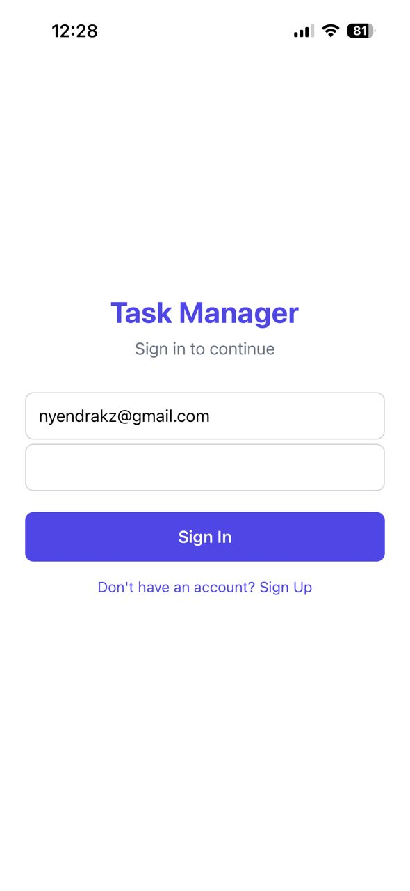
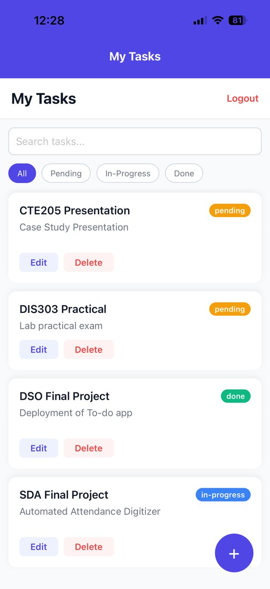
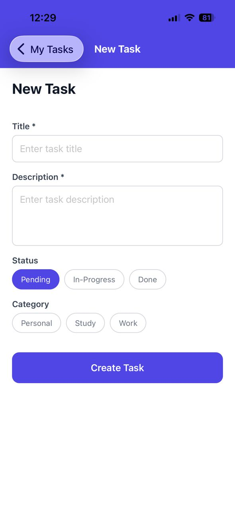
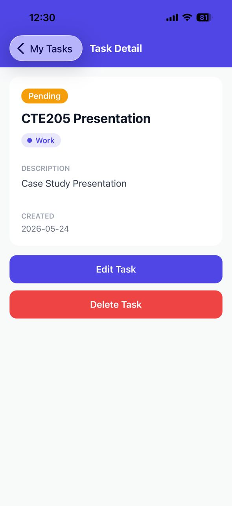
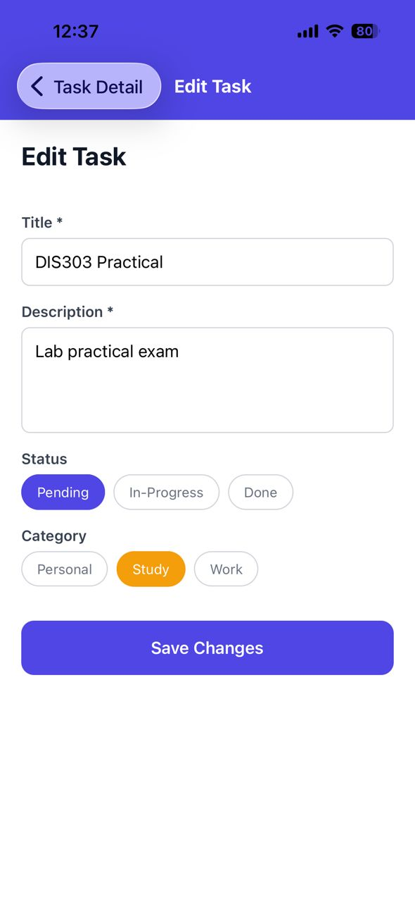

# Task Manager App

A full-featured Task Management application built with React Native (Expo) that allows users to create, read, update, and delete tasks with categories and authentication.

## Domain and Main Entities

**Primary Entity: Tasks**
- Fields: `id`, `title`, `description`, `status`, `category_id`, `due_date`, `created_at`, `user_id`

**Secondary Entity: Categories**
- Fields: `id`, `name`, `color`, `created_at`

**Additional Entity: Users**
- Fields: `id`, `email`, `password`, `created_at`

## State Management Approach

This app uses **Zustand** for global state management.

**Why Zustand?**
- Simple and lightweight (less boilerplate than Redux)
- Built-in TypeScript support
- Easy integration with React hooks
- Excellent middleware support (persistence, devtools)
- Better performance than Context API for frequent updates

**Implementation:**
- Global state stores: tasks, categories, user, token, filters
- State persistence using `zustand/middleware` with AsyncStorage
- Custom selectors for filtered data (`getFilteredTasks`)
- Modular actions for state updates

## Backend Details

**Technology:** Supabase (Backend-as-a-Service)

**Main Endpoints:**

| Method | Endpoint | Purpose |
|--------|----------|---------|
| GET | `/tasks` | Fetch all tasks |
| GET | `/tasks/:id` | Fetch single task |
| POST | `/tasks` | Create new task |
| PATCH | `/tasks/:id` | Update existing task |
| DELETE | `/tasks/:id` | Delete task |
| GET | `/categories` | Fetch all categories |
| POST | `/users` | User registration |
| GET | `/users` | User login (query with email & password) |

**Database Schema:**

```sql
-- Users table
CREATE TABLE users (
  id SERIAL PRIMARY KEY,
  email VARCHAR(255) UNIQUE NOT NULL,
  password VARCHAR(255) NOT NULL,
  created_at TIMESTAMP DEFAULT NOW()
);

-- Categories table
CREATE TABLE categories (
  id SERIAL PRIMARY KEY,
  name VARCHAR(100) NOT NULL,
  color VARCHAR(7) DEFAULT '#6B7280',
  created_at TIMESTAMP DEFAULT NOW()
);

-- Tasks table
CREATE TABLE tasks (
  id SERIAL PRIMARY KEY,
  title VARCHAR(255) NOT NULL,
  description TEXT,
  status VARCHAR(20) DEFAULT 'pending',
  category_id INTEGER REFERENCES categories(id),
  due_date DATE,
  user_id INTEGER REFERENCES users(id),
  created_at TIMESTAMP DEFAULT NOW()
);
```

## Features Implemented

### ✅ Authentication
- Token-based authentication using Supabase
- Sign-up and sign-in screens
- Secure token storage with AsyncStorage
- Auto-login on app restart (token persistence)

### ✅ CRUD Operations
1. **Create**: Form to create new tasks with validation
2. **Read**: List view with filtering, searching, and detail view
3. **Update**: Edit screen to modify existing tasks
4. **Delete**: Delete with confirmation dialog

### ✅ State Management
- **Local state**: `useState` for forms, `useEffect` for data fetching
- **Global state**: Zustand store for tasks, categories, user, filters
- **Custom hooks**: 
  - `useFetchTasks` - Fetches tasks and categories
  - `useForm` - Reusable form state and validation
- **Persistence**: Token and user preferences saved to AsyncStorage

### ✅ Additional Features
- Loading indicators for all network operations
- User-friendly error messages
- Empty state views
- Search functionality
- Status filtering (all, pending, in-progress, done)
- Category selection with color coding
- Responsive navigation

## Project Structure

```
TaskManager/
├── api/                    # Backend API calls
│   ├── auth.js            # Authentication endpoints
│   ├── categories.js      # Category CRUD
│   ├── client.js          # HTTP client (legacy)
│   ├── supabase.js        # Supabase configuration
│   └── tasks.js           # Task CRUD operations
├── assets/                # Images and static resources
├── components/            # Reusable UI components
│   ├── Button.js          # Custom button component
│   ├── Input.js           # Custom input component
│   ├── LoadingSpinner.js  # Loading indicator
│   ├── ErrorMessage.js    # Error display component
│   ├── TaskCard.js        # Task card component
│   ├── Picker.js          # Custom picker/dropdown
│   └── index.js           # Component exports
├── hooks/                 # Custom React hooks
│   ├── useFetchTasks.js   # Fetch tasks and categories
│   └── useForm.js         # Form state management
├── screens/               # Navigation screens
│   ├── LoginScreen.js     # User login
│   ├── SignUpScreen.js    # User registration
│   ├── TaskListScreen.js  # Task list with filters
│   ├── TaskDetailScreen.js # Single task view
│   ├── CreateTaskScreen.js # Create new task
│   └── EditTaskScreen.js  # Edit existing task
├── store/                 # Global state management
│   └── useTaskStore.js    # Zustand store
├── utils/                 # Helper functions
│   ├── constants.js       # App constants
│   ├── helpers.js         # Utility functions
│   ├── validation.js      # Validation rules
│   └── index.js           # Utility exports
├── App.js                 # Main app component
├── config.js              # Configuration (API URLs)
├── .env.example           # Environment variables template
└── package.json           # Dependencies
```

## Setup Instructions

### Prerequisites
- Node.js (v16 or higher)
- npm or yarn
- Expo CLI: `npm install -g expo-cli`
- Expo Go app on your mobile device (available on iOS/Android stores)

### Installation Steps

1. **Clone the repository**
```bash
cd assignment_3/TaskManager
```

2. **Install dependencies**
```bash
npm install
```

3. **Configure environment**
   - Copy `.env.example` to create your own config (optional)
   - Update `config.js` with your Supabase credentials if needed

4. **Backend Setup (Supabase)**
   
   The app is already connected to a working Supabase instance. If you want to use your own:
   
   a. Create a free account at [supabase.com](https://supabase.com)
   
   b. Create a new project
   
   c. Run the SQL schema (provided above) in the SQL editor
   
   d. Update `config.js` with your `SUPABASE_URL` and `SUPABASE_ANON_KEY`
   
   e. Add sample categories:
   ```sql
   INSERT INTO categories (name, color) VALUES
   ('Work', '#3B82F6'),
   ('Personal', '#10B981'),
   ('Shopping', '#F59E0B'),
   ('Health', '#EF4444');
   ```

5. **Run the app**

   **Option 1: Using Expo Go (Recommended)**
   ```bash
   npm start
   ```
   - Scan the QR code with Expo Go app (Android) or Camera app (iOS)
   
   **Option 2: Android Emulator**
   ```bash
   npm run android
   ```
   
   **Option 3: iOS Simulator** (Mac only)
   ```bash
   npm run ios
   ```

### Testing the App

1. **Sign up** with a new account (email and password)
2. **Login** with your credentials
3. **View tasks** - Initially empty
4. **Create tasks** - Click the "+" button
5. **Filter tasks** - Use the status filter buttons
6. **Search tasks** - Type in the search bar
7. **Edit tasks** - Tap on a task, then press Edit
8. **Delete tasks** - Tap on a task, then press Delete
9. **Logout** - Press Logout button in task list

## Dependencies

### Core Dependencies
- `expo` ~54.0.33 - React Native framework
- `react` 19.1.0 - UI library
- `react-native` 0.81.5 - Mobile framework
- `@react-navigation/native` - Navigation
- `@react-navigation/native-stack` - Stack navigation

### State Management
- `zustand` ^5.0.13 - Global state management
- `@react-native-async-storage/async-storage` 2.2.0 - Persistent storage

### Backend
- `@supabase/supabase-js` ^2.106.1 - Supabase client
- `axios` ^1.16.1 - HTTP client (optional)

## Known Limitations

1. **Authentication**: Currently uses basic email/password stored in Supabase table. For production, use Supabase Auth service.
2. **Offline Mode**: App requires internet connection to function.
3. **File Attachments**: Not implemented in this version.
4. **Push Notifications**: Not implemented.
5. **User Profile**: Basic user info only (no profile picture or additional details).
6. **Task Priority**: Field exists in schema but not fully utilized in UI.
7. **Recurring Tasks**: Not supported.

## Future Enhancements

- [ ] Implement Supabase Auth instead of custom auth
- [ ] Add task priority levels with visual indicators
- [ ] Add task due date reminders
- [ ] Implement offline mode with local caching
- [ ] Add file attachments to tasks
- [ ] Add task sharing between users
- [ ] Add task comments/notes
- [ ] Implement dark mode
- [ ] Add data export functionality

## Screenshots

### Login Screen


### Task List


### Create Task


### Task Detail


### Edit Task



