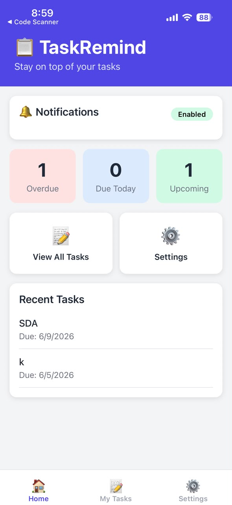
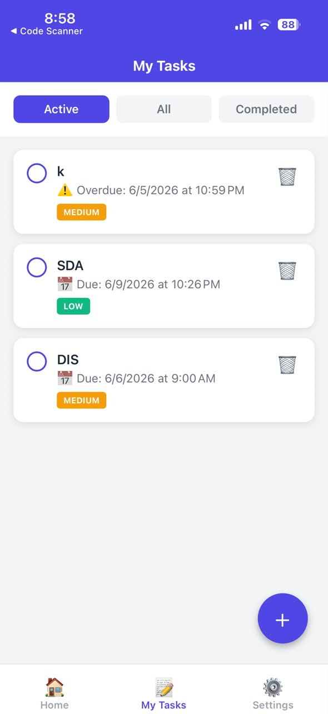
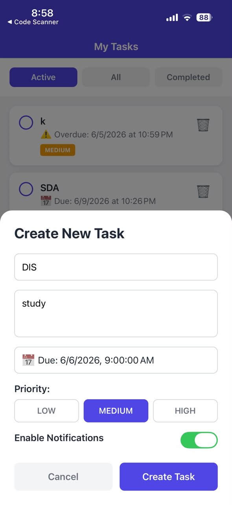
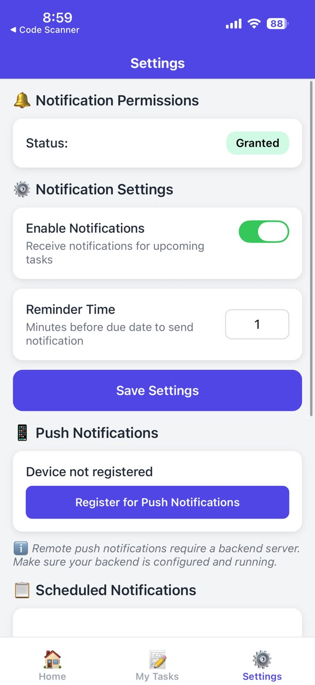

# Assignment 4: Push Notification Mobile App

## Project Overview

**Project Name:** TaskRemind  
**Type:** Task Management with Push Notifications  
**Platform:** React Native with Expo  
**Language:** TypeScript  
**Status:** Complete and Ready for Testing

This folder contains the complete Assignment 4 project - a mobile application demonstrating push notification functionality with local scheduled notifications, remote push notifications, and comprehensive notification handling across different app states.

---


## Quick Start

### Prerequisites
- Node.js 16 or higher
- npm or yarn package manager
- Physical Android or iOS device (recommended for push notifications)
- Expo Go app installed on your device
- Computer and device on the same WiFi network

### Installation Steps

**1. Navigate to project directory:**
```bash
cd assignment_4/TaskRemind
```

**2. Install mobile app dependencies:**
```bash
npm install
```

**3. Install backend dependencies:**
```bash
cd backend
npm install
cd ..
```

**4. Configure environment variables:**
```bash
# Copy environment template
cp .env.example .env

# Get your computer's IP address
# Windows:
ipconfig

# Mac/Linux:
ifconfig
# or
ip addr
```

**5. Edit .env file:**
Open the `.env` file and set your computer's IP address:
```
BACKEND_URL=http://YOUR_IP_ADDRESS:3000
```

Example: `BACKEND_URL=http://192.168.1.100:3000`

**IMPORTANT:** Do NOT use `localhost` or `127.0.0.1` - these will not work on physical devices.

**6. Start the backend server:**
Open a new terminal and run:
```bash
cd assignment_4/TaskRemind/backend
npm start
```

You should see: `Server running on port 3000`

**7. Start the Expo development server:**
In another terminal:
```bash
cd assignment_4/TaskRemind
npm start
```

**8. Run on your device:**
- Scan the QR code with Expo Go (Android) or Camera app (iOS)
- Or press `a` for Android emulator
- Or press `i` for iOS simulator (Mac only)

---

## Prerequisites

### Required Software
- **Node.js**: Version 16 or higher
  - Download: https://nodejs.org/
  - Verify: `node --version`

- **npm**: Comes with Node.js
  - Verify: `npm --version`

- **Expo CLI**: Installed globally (optional but recommended)
  ```bash
  npm install -g expo-cli
  ```

### Required Hardware
- **Physical Device**: Strongly recommended for testing push notifications
  - Emulators/simulators have limited notification support
  - Android device or iPhone with Expo Go installed

### Required Apps
- **Expo Go**:
  - Android: https://play.google.com/store/apps/details?id=host.exp.exponent
  - iOS: https://apps.apple.com/app/expo-go/id982107779

### Network Requirements
- Computer and mobile device must be on the **same WiFi network**
- Firewall should allow connections on ports 3000 (backend) and 8081 (Expo)

---

## Installation

### Step 1: Clone or Download Project
Ensure you have the complete project folder structure.

### Step 2: Install Node.js Dependencies

**Mobile App:**
```bash
cd assignment_4/TaskRemind
npm install
```

This installs ~697 packages including:
- react-native
- expo
- expo-notifications
- @react-navigation/native
- react-native-gesture-handler
- TypeScript and type definitions

**Backend Server:**
```bash
cd assignment_4/TaskRemind/backend
npm install
```

This installs:
- express
- expo-server-sdk
- cors
- body-parser
- dotenv

### Step 3: Verify Installation

Check that `node_modules` folder exists in both:
- `assignment_4/TaskRemind/node_modules`
- `assignment_4/TaskRemind/backend/node_modules`

### Common Installation Issues

**Issue: npm install fails with dependency errors**

Solution:
```bash
# Clear npm cache
npm cache clean --force

# Delete node_modules and package-lock.json
rm -rf node_modules package-lock.json

# Reinstall with legacy peer deps flag
npm install --legacy-peer-deps
```

**Issue: Permission errors on Mac/Linux**

Solution:
```bash
sudo npm install
# Or fix npm permissions: https://docs.npmjs.com/resolving-eacces-permissions-errors
```

---

## Configuration

### Environment Variables Setup

**1. Create .env file for mobile app:**
```bash
cd assignment_4/TaskRemind
cp .env.example .env
```

**2. Get your computer's IP address:**

**Windows:**
```bash
ipconfig
```
Look for "IPv4 Address" under your WiFi adapter (e.g., 192.168.1.100)

**Mac/Linux:**
```bash
ifconfig
# or
ip addr show
```
Look for `inet` address under your WiFi interface (e.g., 192.168.1.100)

**3. Edit .env file:**
```
BACKEND_URL=http://192.168.1.100:3000
```
Replace `192.168.1.100` with YOUR actual IP address.

**4. (Optional) Create .env for backend:**
```bash
cd assignment_4/TaskRemind/backend
cp .env.example .env
```

Default backend settings:
```
PORT=3000
API_KEY=dev-api-key-12345
```

---

## Running the Application

### Starting the Backend Server

**Terminal 1:**
```bash
cd assignment_4/TaskRemind/backend
npm start
```

Expected output:
```
TaskRemind Backend Server
========================
Environment: development
API Key: dev-api-key-12345
Port: 3000

Server running on port 3000
Push notification service initialized
```

**Test backend is running:**
```bash
curl http://localhost:3000
```

Or visit `http://localhost:3000` in your browser.

### Starting the Mobile App

**Terminal 2:**
```bash
cd assignment_4/TaskRemind
npm start
```

Expected output:
```
Metro waiting on exp://192.168.1.100:8081
› Scan the QR code above with Expo Go (Android) or the Camera app (iOS)
```

### Running on Device

**Android (Expo Go):**
1. Open Expo Go app
2. Tap "Scan QR code"
3. Scan the QR code in your terminal
4. Wait for app to load

**iOS (Camera app):**
1. Open Camera app
2. Point at QR code
3. Tap the notification to open in Expo Go
4. Wait for app to load

**Alternative Methods:**
```bash
# Android emulator
npm run android

# iOS simulator (Mac only)
npm run ios
```

---

## Features

### Core Features
- Task CRUD (Create, Read, Update, Delete)
- Local scheduled notifications before task due dates
- Remote push notifications from backend server
- Foreground notification handling
- Background notification handling
- Notification tap navigation to specific tasks
- Priority-based notification channels (regular and urgent)
- Per-task notification control (enable/disable per task)

### Additional Features
- Task dashboard with statistics (overdue, due today, upcoming)
- Task filtering (active, all, completed)
- Configurable reminder timing (minutes before due date)
- Test notification buttons (immediate testing)
- Backend REST API with 6 endpoints
- Device token management and registration
- Broadcast notifications to all devices
- Permission status display and management
- Data persistence with AsyncStorage

---

## Project Structure

```
TaskRemind/
├── Mobile App
│   ├── screens/
│   │   ├── HomeScreen.tsx            # Dashboard with stats
│   │   ├── TasksScreen.tsx           # Task list and creation
│   │   ├── TaskDetailScreen.tsx      # Task detail with controls
│   │   └── SettingsScreen.tsx        # App configuration
│   ├── services/
│   │   ├── notificationService.ts    # Notification API wrapper
│   │   └── storageService.ts         # AsyncStorage wrapper
│   ├── api/
│   │   └── backendClient.ts          # HTTP client for backend
│   ├── types/
│   │   └── task.ts                   # TypeScript interfaces
│   ├── navigation/
│   │   └── AppNavigator.tsx          # React Navigation setup
│   ├── App.tsx                       # Main app component
│   ├── app.json                      # Expo configuration
│   ├── package.json                  # Dependencies
│   ├── tsconfig.json                 # TypeScript config
│   └── .env                          # Environment variables
│
├── Backend Server
│   ├── server.js                     # Express API server
│   ├── package.json                  # Backend dependencies
│   └── .env                          # Backend environment
│
├── Documentation
│   ├── README.md                     # This file
│   ├── ASSIGNMENT_REPORT.md          # Requirements mapping
│   └── backend/README.md             # Backend API docs
│
└── Resources
    ├── .env.example                  # Environment template
    └── screenshots/                  # App screenshots
```

---

## Tech Stack

### Mobile Application
- **React Native**: 0.81.5 - Cross-platform mobile framework
- **Expo**: ~54.0.0 - Development platform and build system
- **TypeScript**: ~5.9.2 - Type safety and developer experience
- **React Navigation**: 7.x - Navigation library
  - @react-navigation/native: ^7.1.0
  - @react-navigation/stack: ^7.2.0
  - @react-navigation/bottom-tabs: ^7.3.0
- **Expo Notifications**: ~0.32.17 - Push notification API
- **AsyncStorage**: 2.2.0 - Local data persistence
- **Axios**: 1.6.2 - HTTP client for backend communication
- **React Native Gesture Handler**: ~2.28.0 - Gesture support

### Backend Server
- **Node.js**: JavaScript runtime
- **Express**: 4.18.2 - Web framework
- **Expo Server SDK**: 3.7.0 - Push notification sending
- **CORS**: 2.8.5 - Cross-origin resource sharing
- **Body Parser**: 1.20.2 - Request parsing
- **dotenv**: 16.0.3 - Environment configuration

---

## Testing Guide

### Initial Setup Testing

**1. Grant Notification Permissions:**
- Open app
- Navigate to Home screen
- Tap "Grant Notification Permissions" button
- Allow notifications when prompted
- Verify green checkmark appears

**2. Register Device for Push:**
- Go to Settings screen
- Tap "Register for Push Notifications"
- Wait for success message
- Verify "Device Registered" status shows

### Local Notification Testing

**1. Create Task with Notification:**
- Go to Tasks screen
- Tap + button
- Fill in:
  - Title: "Test Task"
  - Description: "Testing notification"
  - Due date: 15 minutes from now
  - Priority: High
  - Enable Notifications: ON
- Tap "Create Task"
- Wait 15 minutes for notification

**2. Test Immediate Notification:**
- Go to Tasks screen
- Tap on any task
- Tap "Send Test Notification"
- Check system tray for notification
- Tap notification to navigate back to task

### Remote Push Testing

**1. Backend Test:**
- Ensure backend is running
- Go to Settings screen
- Tap "Send Test Remote Notification"
- Wait 2-3 seconds
- Check for notification in system tray

**2. Verify Backend Logs:**
Check backend terminal for:
```
POST /api/send-notification
Sending notification to: ExponentPushToken[...]
Notification sent successfully
```

### Notification State Testing

**Foreground (App Open):**
- Keep app open
- Send test notification
- Observe banner at top of screen
- Check console logs in terminal

**Background (App Minimized):**
- Minimize app (press home button)
- Wait for scheduled notification
- Notification appears in system tray
- Shows icon, title, body, timestamp

**Tapped (User Interaction):**
- Receive notification (from any test)
- Tap notification in system tray
- App opens to TaskDetailScreen
- Correct task details displayed

### Priority Channel Testing

**Regular Priority:**
- Create task with Low or Medium priority
- Notification uses "task-reminders" channel
- Standard sound and vibration

**High Priority:**
- Create task with High priority
- Notification uses "urgent-tasks" channel
- Urgent sound and strong vibration

---

## Troubleshooting

### Common Issues and Solutions

**Issue 1: "Cannot connect to backend" error**

Symptoms:
- App shows connection errors
- Remote notifications don't work
- Backend API calls fail

Solutions:
1. Verify backend is running: `curl http://localhost:3000`
2. Check .env file has correct IP address (not localhost)
3. Ensure device and computer on same WiFi
4. Check firewall allows port 3000
5. Restart backend server

**Issue 2: Notifications not appearing**

Symptoms:
- No notifications in system tray
- Scheduled notifications don't fire

Solutions:
1. Grant notification permissions in app
2. Check device notification settings (Settings > Apps > Expo Go)
3. Verify task has "Enable Notifications" toggled ON
4. Ensure due date is in the future
5. Use physical device (not emulator)
6. Check battery optimization settings (Android)

**Issue 3: App won't start or crashes immediately**

Symptoms:
- App shows error screen
- Metro bundler errors
- "Unable to resolve module" errors

Solutions:
1. Clear Metro bundler cache:
   ```bash
   npm start -- --clear
   ```
2. Reinstall dependencies:
   ```bash
   rm -rf node_modules package-lock.json
   npm install
   ```
3. Restart Expo Go app on device
4. Check for TypeScript errors: `npm run type-check`

**Issue 4: "TurboModuleRegistry" or "PlatformConstants" errors**

Symptoms:
- App crashes with module errors
- Native module not found errors

Solutions:
1. Clear cache and reinstall:
   ```bash
   npm start -- --clear
   rm -rf node_modules
   npm install
   ```
2. Update Expo SDK version to match Expo Go app
3. Ensure react-native-gesture-handler import at top of App.tsx

**Issue 5: TypeScript errors in VS Code**

Symptoms:
- Red squiggly lines in code
- Type errors in editor
- "Cannot find module" errors

Solutions:
1. Restart TypeScript server: Cmd/Ctrl + Shift + P > "TypeScript: Restart TS Server"
2. Ensure dependencies installed: `npm install`
3. Check tsconfig.json exists
4. Restart VS Code

**Issue 6: Backend port already in use**

Symptoms:
- Backend shows "EADDRINUSE" error
- Port 3000 already in use

Solutions:
**Windows:**
```bash
# Find process on port 3000
netstat -ano | findstr :3000

# Kill the process (replace PID)
taskkill /PID <PID> /F
```

**Mac/Linux:**
```bash
# Find and kill process on port 3000
lsof -ti:3000 | xargs kill -9
```

**Issue 7: QR code not scanning**

Symptoms:
- QR code won't scan
- Expo Go can't connect

Solutions:
1. Ensure device and computer on same WiFi
2. Try typing URL manually in Expo Go
3. Use tunnel mode: `npm start --tunnel`
4. Check router allows device-to-device communication

**Issue 8: "Network request failed" on device**

Symptoms:
- API calls timeout
- Can't reach backend from device

Solutions:
1. Find correct IP address: `ipconfig` or `ifconfig`
2. Update .env with correct IP (not localhost)
3. Test backend from browser: `http://YOUR_IP:3000`
4. Disable VPN if active
5. Check Windows Firewall / Mac firewall settings

**Issue 9: Push token registration fails**

Symptoms:
- "Invalid UUID" error
- "Experience does not exist" error

Solutions:
1. This is expected for development without Expo account
2. Local scheduled notifications work without push token
3. For full remote push: Run `eas init` and create Expo project
4. Current implementation handles this gracefully

**Issue 10: iOS notifications not working**

Symptoms:
- Notifications work on Android but not iOS
- iOS permissions denied

Solutions:
1. Check iOS notification permissions in device Settings
2. Ensure Expo Go has notification permission
3. iOS requires explicit permission grant
4. Test on physical iOS device (not simulator when possible)

---

## Environment Configuration

### .env File Reference

**Mobile App (.env):**
```
BACKEND_URL=http://192.168.1.100:3000
```

Replace `192.168.1.100` with your actual IP address.

**Backend Server (backend/.env):**
```
PORT=3000
API_KEY=dev-api-key-12345
NODE_ENV=development
```

---

## Quick Commands Reference

```bash
# Install all dependencies
npm install && cd backend && npm install && cd ..

# Start backend
cd backend && npm start

# Start mobile app
npm start

# Clear cache and start
npm start -- --clear

# Run on Android emulator
npm run android

# Run on iOS simulator (Mac only)
npm run ios

# Type check
npm run type-check

# Lint code
npm run lint
```

---

## Screenshots

For assignment submission, include screenshots showing:

1. Home screen with permission status


2. Task list with multiple tasks


3. Task detail with notification toggle


4. Settings screen with configuration options 



---

